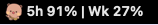

# Codex Bubu Bar

一个 macOS 状态栏小工具，用来显示 Codex 剩余额度：


```text
5h 87% | Wk 98%
```

它每 20 分钟请求一次 Codex App 的 Usage & billing 接口：

```text
https://chatgpt.com/backend-api/wham/usage
```

这个请求只读取额度信息，不运行 `codex exec`，不发送模型 prompt，正常情况下不消耗 Codex 模型 tokens。

## 效果

实际显示效果：



- 状态栏显示：`小熊图标 + 5h xx% | Wk xx%`
- `5h`：5 小时窗口剩余百分比
- `Wk`：weekly 窗口剩余百分比
- 每 20 分钟自动刷新一次
- 菜单里可以点 `Refresh Now` 立即刷新

## 前置条件

需要本机已经安装并登录 Codex：

```sh
codex login status
```

如果没有登录，先执行：

```sh
codex login
```

还需要 macOS 有 Swift 编译器，一般安装 Xcode Command Line Tools 即可：

```sh
xcode-select --install
```

## 安装

在项目目录执行：

```sh
./scripts/install.sh
```

安装后会生成：

```text
~/Applications/CodexUsageBar.app
~/.local/bin/codex-usage-refresh
~/.local/bin/codex-usage-remaining
~/Library/LaunchAgents/com.madness.codexusagebar.plist
```

安装脚本会自动启动状态栏 App，并配置登录后自启。

## 手动检查

主动刷新一次额度：

```sh
codex-usage-refresh
```

查看当前状态栏文本：

```sh
codex-usage-remaining
```

查看 JSON：

```sh
codex-usage-remaining --json
```

## 卸载

```sh
./scripts/uninstall.sh
```

## 数据保存在哪里

运行状态保存在：

```text
~/.local/state/codex-usage-bar
```

本地快照只保存显示所需字段，例如 plan type 和 rate limit 窗口，不保存邮箱。

## 如何更换布布图片

状态栏图标文件是：

```text
assets/bear-logo-menubar.png
```

README 里展示的大图是：

```text
assets/bear-logo-transparent.png
```

替换方法：

1. 准备一张透明背景 PNG。
2. 状态栏图标建议做成 `128x128`，替换 `assets/bear-logo-menubar.png`。
3. README 展示图可以尺寸大一些，替换 `assets/bear-logo-transparent.png`。
4. 重新安装：

```sh
./scripts/install.sh
```

如果你只想换状态栏里的图标，替换 `assets/bear-logo-menubar.png` 即可。

注意：

- 图片必须是透明背景，否则状态栏里会出现白底。
- 文件名不变时，不需要改 Swift 代码。
- 如果你想改文件名，需要同步修改 `CodexUsageBar.swift` 里的 `bear-logo-menubar`。

## Plan B：让 Codex 帮你处理

### 方案一：让 Codex 配置这个仓库

如果你换电脑、路径乱了，或者状态栏不刷新，可以直接把下面这段提示词发给 Codex：

```text
请帮我在这台 Mac 上配置 Codex Bubu Bar。

要求：
1. 项目目录是当前仓库。
2. 先确认 `codex login status` 正常。
3. 执行 `./scripts/install.sh` 安装状态栏 App。
4. 安装后运行 `codex-usage-refresh`，确认它能请求 `https://chatgpt.com/backend-api/wham/usage`。
5. 再运行 `codex-usage-remaining --json`，确认输出里有 `5h xx% | Wk xx%`。
6. 如果刷新失败，检查 `~/.local/state/codex-usage-bar/last-refresh.err.log`。
7. 不要使用 `codex exec` 来刷新额度，避免消耗模型 tokens。
```

### 方案二：让 Codex 从 0 创建一个同类状态栏工具

如果你不想依赖这个仓库，可以直接把下面这段提示词发给 Codex，让它从 0 创建：

```text
请帮我从 0 创建一个 macOS 状态栏小工具，用来显示 Codex 剩余额度。

功能要求：
1. 状态栏显示格式：`5h xx% | Wk xx%`。
2. 左侧放一个透明 PNG 小图标，图标文件名用 `assets/bear-logo-menubar.png`。
3. 每 20 分钟刷新一次。
4. 点击菜单里的 `Refresh Now` 可以手动刷新。
5. 刷新方式必须请求 Codex App 使用的 Usage & billing 接口：
   `https://chatgpt.com/backend-api/wham/usage`
6. 使用本机 Codex 登录态 `~/.codex/auth.json` 里的 ChatGPT access token 鉴权。
7. 不要用 `codex exec`，不要发送模型 prompt，避免消耗 Codex 模型 tokens。
8. 本地状态保存到 `~/.local/state/codex-usage-bar`。
9. 写一个 `scripts/install.sh`，负责编译 Swift 状态栏 App、安装命令行脚本、配置 LaunchAgent 自启。
10. 写一个 `scripts/uninstall.sh`，负责删除 App、命令行脚本和 LaunchAgent。

实现建议：
- 用 Swift 写 `NSStatusItem` 菜单栏 App。
- 用 Python 写 `codex-usage-refresh` 请求 usage API。
- 用 Python 写 `codex-usage-remaining` 读取本地快照并输出显示文本。
- 如果 usage API 失败，可以 fallback 到本地 Codex session JSONL 里的 `rate_limits` 事件。
- README 用中文，说明安装、卸载、换图标和故障排查。
```

## 注意

`/backend-api/wham/usage` 是 Codex App 使用的内部接口，未来可能变化。如果接口失效，脚本会退回读取本地 Codex session 日志里的 `rate_limits` 事件，但这个 fallback 不一定实时。
